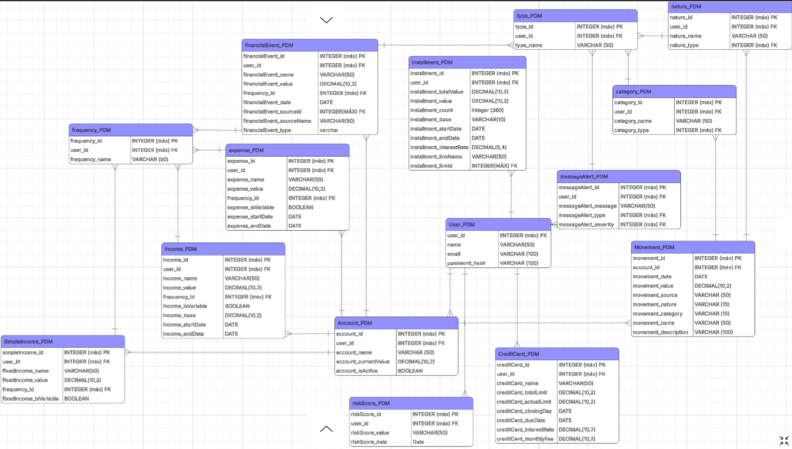

# PDM (Personal Decisions Machine)
A project designed to solve the financial problems of people who have difficulties with their money.

# Target Audience
- People who have more than one credit card
- People who have some difficulty saving money or making smart decisions that won't negatively affect their future.

# The Problem
- Amount of future compromised income
- Amount of money that will be left over or needed
- The true impact installments payments today

# Features
- Finantial timeline
- Amount of future compromised income
- Amount of money that will be left over or needed
- The true impact installments payments today
- installments payments Simulating
- Personal Score

# Functional requirements
# Non-Functional requirements
# Data modeling

# Screen Flow
# Prototype
# Formulas
# APIS
# Tools
# Lenguages
# Database 
